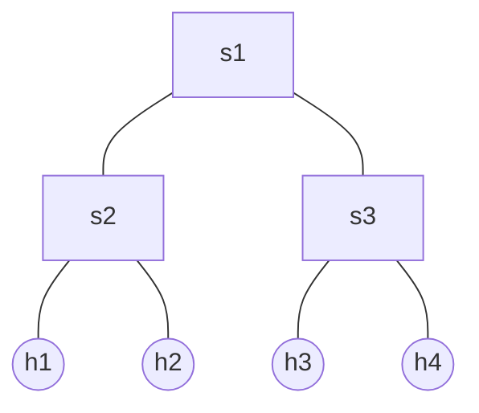

# 🐟 Tutorial 1: Using the Stratum Mininet Docker Image

🚧 This tutorial is [under development](## "Technical content okay; grammar not read good ;)").

This tutorial shows how to connect Finsy to a software switch running in a Docker container. If you
already have a P4Runtime switch or you are familiar with docker/mininet/stratum, you can skip this 
tutorial.

We will set up an SSH tunnel to Stratum/MiniNet running in Docker on a separate Linux host/VM. This 
keeps your development machine and test environment separate. (It's also possible to run Docker 
Desktop on your development machine -- that is out of scope for this tutorial.)

When we are done, you will be able to connect to stratum switches running in Mininet simply
by connecting to `127.0.0.1:50001`, `127.0.0.1:50002`, and `127.0.0.1:50003` on your development
machine. You will activate the SSH tunnel to Mininet by running `ssh mininet`.

## ◉ Requirements

- Ubuntu Server 22.04, running on x86_64, with SSH access.
- Docker engine (or podman).

Follow the directions for [installing Docker Engine](https://docs.docker.com/engine/install/ubuntu/) 
on Ubuntu using the APT repository.

Make sure that you can connect to your Ubuntu server using SSH. Note the SSH host name, port number, 
and user name for the next step.

## ◉ Configure SSH

On your development machine, add the following snippet to your `~/.ssh/config` file. Replace \<SSH-HOST\>,
\<SSH-PORT\> and \<SSH-USER\> with the appropriate values.

```
Host mininet
  HostName <SSH-HOST>
  Port <SSH-PORT>
  User <SSH-USER>
  LocalForward 50001 localhost:50001
  LocalForward 50002 localhost:50002
  LocalForward 50003 localhost:50003
  ExitOnForwardFailure yes
  RequestTTY yes
  # RemoteCommand must be all on one line.
  RemoteCommand echo -e '\033[1mStarting Mininet...\033[0m'; sudo docker run --privileged --rm -it -p 50001-50003:50001-50003 --name mininet opennetworking/mn-stratum --topo=tree,2
  # FIXME: SIGHUP does not stop the container :(
```

If you type `ssh mininet`, you will connect to Linux and run the mn-stratum docker container.

```shell
$ ssh mininet
Starting Mininet...
[sudo] password for bfish: ******
Unable to find image 'opennetworking/mn-stratum:latest' locally
latest: Pulling from opennetworking/mn-stratum
0e9cbea72135: Already exists 
a04ac269bdc5: Pull complete 
fab6c7bb38bb: Pull complete 
fefe683b1cdd: Pull complete 
2e54107ab1d6: Pull complete 
7f9c3dea6254: Pull complete 
00343c7f4112: Pull complete 
310314ea90f5: Pull complete 
Digest: sha256:6daeddf7849d4c7aae46635cc0e4b5d52505ee7d0f6161723e413afc658c4838
Status: Downloaded newer image for opennetworking/mn-stratum:latest
*** Error setting resource limits. Mininet's performance may be affected.
*** Creating network
*** Adding controller
*** Adding hosts:
h1 h2 h3 h4 
*** Adding switches:
s1 s2 s3 
*** Adding links:
(s1, s2) (s1, s3) (s2, h1) (s2, h2) (s3, h3) (s3, h4) 
*** Configuring hosts
h1 h2 h3 h4 
*** Starting controller

*** Starting 3 switches
s1 ⚡️ stratum_bmv2 @ 50001
s2 ⚡️ stratum_bmv2 @ 50002
s3 ⚡️ stratum_bmv2 @ 50003

*** Starting CLI:
mininet>
```

To exit mininet, type CONTROL-D or `exit`.

The network topology looks like this:




## 🎉 Next Steps

That's it. The remaining tutorials assume that they can connect to P4Runtime/gNMI devices
running on localhost at ports 50001, 50002, and 50003.

The next tutorial shows how to use Finsy's gNMI client.

[➡️ Go to Tutorial 2.](tutorial_2.md)
