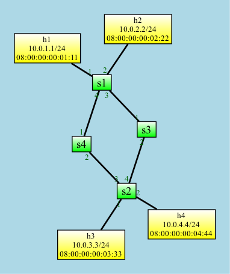

# basic Demo

The basic directory demonstrates the `Basic Forwarding` example from the [P4 Tutorial](https://github.com/p4lang/tutorials/tree/master/exercises/basic).

The demo network looks like this picture. To start Mininet, type `./net/run.py`.



The P4Info.txt for the `basic.p4` program looks like this:

```
<Unnamed> (version=, arch=v1model)
⎯⎯⎯⎯⎯⎯⎯⎯⎯⎯⎯⎯⎯⎯⎯⎯⎯⎯⎯⎯⎯⎯⎯⎯⎯⎯⎯⎯⎯⎯⎯⎯⎯
📋 ipv4_lpm[1024]
   dstAddr/32
   ipv4_forward(dstAddr:48, port:9) drop() NoAction()
```

## Running the Demo

To run the demo network, type `./net/run.py`.

In the Mininet CLI, the `h1 ping h2` command will fail because there are no 
entries loaded into the `ipv4_lpm` switch tables.

To load the P4 tables with the proper entries, run `python demo.py`. The program should
exit immediately after loading entries for all four switches.

In the Mininet CLI, the `pingall` command now works. 
