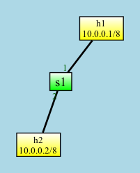

# flowcache Demo

The flowcache directory demonstrates the `Flow Cache` example from 
[jafingerhut/p4-guide](https://github.com/jafingerhut/p4-guide/tree/master/flowcache).

The P4Runtime controller in this example is interesting because it uses a
serializable enum from the P4 program.

The demo network looks like this picture. To start Mininet, type `./net/run.py`.



The P4Info.txt for the `flowcache.p4` program looks like this:

```
<Unnamed> (version=, arch=v1model)
⎯⎯⎯⎯⎯⎯⎯⎯⎯⎯⎯⎯⎯⎯⎯⎯⎯⎯⎯⎯⎯⎯⎯⎯⎯⎯⎯⎯⎯⎯⎯⎯⎯
📋 flow_cache[65536]
   protocol:8 src_addr:32 dst_addr:32
   cached_action(port:9, decrement_ttl:1, new_dscp:6) drop_packet() flow_unknown()
📋 dbgPacketOutHdr[1024]
   opcode:8 reserved1:8
   NoAction()
   🔒NoAction()
📋 debug_egress_stdmeta[1024]
   ingress_port:9 egress_spec:9 egress_port:9 instance_type:32 packet_length:32
   NoAction()
   🔒NoAction()
📬 packet_out
   opcode:8 reserved1:8 operand0:32
📬 packet_in
   input_port:16 punt_reason:8 opcode:8
```

## Running the Demo

To run the demo network, type `./net/run.py`.

To start the controller, type in a second terminal `python demo.py`.

In the Mininet CLI, if you type `h1 ping h2`, you should see a log message in
the controller indicating that it added an entry to the `flow_cache` P4 table.
However, the ping command will fail because the IP packet is just being forwarded
to a random port. You can also type `h2 ping h1` to add a second `flow_cache`
entry.

```
1713488515.116 INFO flowcache [sw1] Delete all entries
1713488515.120 INFO flowcache [sw1] Insert CloneSessionEntry
1713488520.786 INFO flowcache [sw1] Insert into flow_cache: protocol=0x1 src_addr=0xa000001 dst_addr=0xa000002 -> cached_action(port=0x3, decrement_ttl=0x1, new_dscp=0x5)
```

To see the log messages from the Mininet switch, type 
`sh cat /tmp/s1/log.txt` in the Mininet CLI.
