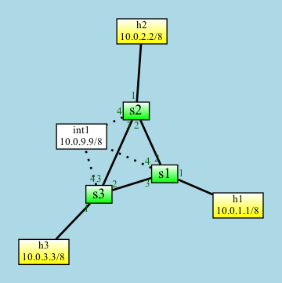

# INT Demo

This demo provides an alternate P4Runtime implementation for the [GEANT INT implementation](https://github.com/GEANT-DataPlaneProgramming/int-platforms).

The demo network looks like this picture. To start Mininet, type `./net/run.py`.



The P4Info file looks like this:

```
<Unnamed> (version=, arch=v1model)
⎯⎯⎯⎯⎯⎯⎯⎯⎯⎯⎯⎯⎯⎯⎯⎯⎯⎯⎯⎯⎯⎯⎯⎯⎯⎯⎯⎯⎯⎯⎯⎯⎯
📋 tb_int_source[127]
   srcAddr/&32 dstAddr/&32 l4_src/&16 l4_dst/&16 
   configure_source(max_hop:8, hop_metadata_len:5, ins_cnt:5, ins_mask:16) ↓NoAction()
📋 tb_activate_source[255]
   ingress_port:9 
   activate_source() ↓NoAction()
📋 tb_forward[31]
   dstAddr/&48 
   send_to_cpu(port:9) send_to_port(port:9) ↓NoAction()
📋 tb_port_forward[31]
   egress_port:9 
   send(port:9) ↓NoAction()
📋 tb_int_sink[255]
   egress_spec:9 
   configure_sink(sink_reporting_port:16) ↓NoAction()
📋 tb_int_transit[1024]
   configure_transit(switch_id:32, l3_mtu:16) ↓NoAction()
📋 tb_int_inst_0003[1024]🔒
   instruction_mask/&16 
   int_set_header_0003_i0() int_set_header_0003_i1() ... int_set_header_0003_i15() ↓NoAction()
📋 tb_int_inst_0407[1024]🔒
   instruction_mask/&16 
   int_set_header_0407_i0() int_set_header_0407_i1() ... int_set_header_0407_i15() ↓NoAction()
📋 tb_int_reporting[512]
   send_report(dp_mac:48, dp_ip:32, collector_mac:48, collector_ip:32, collector_port:16) ↓NoAction()
```

## Running the Demo

To run the demo network, type `./net/run.py`

To run the Finsy controller, type `python demo`

To trigger an INT report, send a UDP packet from h1 to h2. Type at the Mininet prompt: `h1 echo abc | socat - udp:10.0.2.2:5555`

## Notes

This example has the following known issues:

- The packet received by 10.0.2.2 does not appear to have the INT header removed. Its UDP checksum is also wrong.

- The number of INT reports increases with each controller restart. The pipeline reset is not erasing all runtime state.

- It's not possible to forward UDP packets out of a podman container/VM to the controller. I'm not sure if this is due to my own firewall config. TCP works fine.