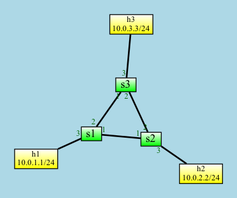

# tunnel Demo

The tunnel directory demonstrates the `P4Runtime` example from the [P4 Tutorial](https://github.com/p4lang/tutorials/tree/master/exercises/p4runtime).



The P4Info.txt for the `advanced_tunnel.p4` program looks like this:

```
<Unnamed> (version=, arch=v1model)
⎯⎯⎯⎯⎯⎯⎯⎯⎯⎯⎯⎯⎯⎯⎯⎯⎯⎯⎯⎯⎯⎯⎯⎯⎯⎯⎯⎯⎯⎯⎯⎯⎯
📋 ipv4_lpm[1024]
   dstAddr/32 
   ipv4_forward(dstAddr:48, port:9) myTunnel_ingress(dst_id:16) drop() NoAction()
📋 myTunnel_exact[1024]
   dst_id:16 
   myTunnel_forward(port:9) myTunnel_egress(dstAddr:48, port:9) drop()
📈 ingressTunnelCounter[65536]: both
📈 egressTunnelCounter[65536]: both
```

## Running the Demo

To run the demo network, type `./net/run.py`.

To load the P4 tables with the proper entries, run `python demo1.py`. The program should
exit immediately with no output.

In the Mininet CLI, the `h1 ping h2` and `h2 ping h1` commands now work. `h3` cannot ping 
anyone because the script only sets up a tunnel between `h1` and `h2`.

If you run `python demo2.py`, this demo program will print out the ingress and egress
counters for tunnels 100 and 200. The `demo2.py` program is read-only.
